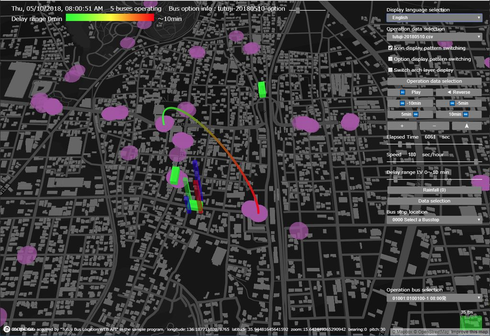

# Harmoware-VIS


## はじめに
本ソフトウェアは JST OPERA (産学共創プラットフォーム共同研究推進プログラム)の支援を受けて、
人間機械協奏技術コンソーシアム (HMHS: Human Machine Harmonization System) (http://hmhs.jp)
において、主に名古屋大学河口研究室が中心になって開発したものです。

UBERが開発した Deck.GL( http://uber.github.io/deck.gl/ ) を利用し、その上に移動体とその付加情報を可視化する機能を
追加しています。

## Install

### 事前準備
- node, npm のインストール
- Mapbox access token の取得(後述）と環境変数(MAPBOX_ACCESS_TOKEN)の設定

以下で例が動作します
```
git clone https://github.com/Harmoware/Harmoware-VIS
cd Harmoware-VIS
npm install
# example bus3d
npm run bus3d
```

★注意事項★
node.js のバージョンは v9.11.1 で確認しています。

## Using Harmoware-VIS

### Mapbox Accesstoken Setting

[mapbox.com](https://www.mapbox.com/ "mapbox.com") から Accesstoken を取得してください。

### User Application Examples

```javascript
// app.js　mapboxを使用する場合のサンプル
import React from 'react';
import {
  Container, connectToHarmowareVis,
  HarmoVisLayers, MovesLayer, DepotsLayer,
  MovesInput, DepotsInput, SimulationDateTime,
  PauseButton, ForwardButton, ReverseButton, AddMinutesButton,
  ElapsedTimeRange, SpeedRange
} from 'harmoware-vis';

const MAPBOX_TOKEN = XXXXXXXXXX; //mapbox.com から取得したAccesstoken

class App extends Container {

  render() {
    const { viewport, actions, routePaths, lightSettings,
      animatePause, animateReverse, settime, secperhour, timeBegin, timeLength,
      movesbase, movedData, clickedObject, depotsData } = this.props;

    return (
      <div>
        <div className="controller_area"> //コントローラーエリア
          <ul>
            <li><MovesInput actions={actions} /></li>
            <li><DepotsInput actions={actions} /></li>
            <li>{animatePause ?
              <PlayButton actions={actions} /> :
              <PauseButton actions={actions} />}</li>
            <li>{animateReverse ?
              <ForwardButton actions={actions} /> :
              <ReverseButton actions={actions} />}</li>
            <li><AddMinutesButton addMinutes={-5} actions={actions} />&nbsp;
              <AddMinutesButton addMinutes={5} actions={actions} /></li>
            <li><SimulationDateTime timeBegin={timeBegin} settime={settime} /></li>
            <li><ElapsedTimeRange settime={settime} timeLength={timeLength} actions={actions} /></li>
            <li><SpeedRange secperhour={secperhour} actions={actions} /></li>
          </ul>
        </div>

        <div className="harmovis_area"> //シュミレーションエリア
          <HarmoVisLayers
            viewport={viewport} actions={actions}
            mapboxApiAccessToken={MAPBOX_TOKEN}
            layers={[
              new MovesLayer({ routePaths, movesbase, movedData, clickedObject, actions, }),
              new DepotsLayer({ depotsData, }),
            ]}
          />
        </div>
      </div>
    );
  }
}
export default connectToHarmowareVis(App);
```

## Harmoware-VIS API

### Harmoware-VIS State

Harmoware-VIS で定義されるState一覧

| props | Type | Default | Description |
| :------------ | :------------ | :------------ | :------------ |
| animatePause | Boolean | false | アニメーション停止 |
| animateReverse | Boolean | false | アニメーション再生正逆 |
| bounds | object | {} | 運行シュミレーション範囲（東西南北 端） |
| defaultPitch | Number | 30 | 地図表示時規定角度 |
| defaultZoom | Number | 11.1 | 地図表示時規定拡大値 |
| depotsBase | Array | [] | 停留所データ保持エリア |
| depotsData | Array | [] | 描画用停留所データ |
| getDepotsOptionFunc | Function | null | 停留所データオプション処理関数 |
| getMovesOptionFunc | Function | null | 運行データオプション処理関数 |
| leading | Number | 100 | シュミレーション前余白時間（秒） |
| lightSettings | object | {...} | 3Ｄオブジェクト用光源設定 |
| movedData | Array | [] | 描画用運行データ |
| movesbase | Array | [] | 運行データ保持エリア |
| clickedObject | Array | null | 選択中運行オブジェクト |
| routePaths | Array | [] | 描画用運行経路 |
| secperhour | Number | 3 | 再生速度（秒/時） |
| settime | Number | 0 | シュミレーション中時間 |
| timeBegin | Number | 0 | シュミレーション開始時刻UNIX時間（秒） |
| timeLength | Number | 0 | シュミレーション期間（秒） |
| trailing | Number | 180 | シュミレーション後余白時間（秒） |
| viewport | object | {...} | マップ視点情報 |
| loading | Boolean | false | ローディング中情報 |

### Harmoware-VIS Actions

Harmoware-VIS で定義される redux の action は以下の通りです。

| action | update props | Description |
| :------------ | :------------ | :------------ |
| addMinutes(Number) | settime  | シュミレーション中時間加算（分）更新 |
| setTime(Number) | settime | シュミレーション中時間更新 |
| setLeading(Number) | leading | シュミレーション前余白時間（秒）更新 |
| setTrailing(Number) | trailing | シュミレーション後余白時間（秒）更新 |
| setViewport(object) | viewport | マップ視点情報更新 |
| setLightSettings(object) | lightSettings | 3Ｄオブジェクト用光源設定更新 |
| setMovesBase(object/Array) | timeBegin, timeLength, bounds, movesbase | 運行シュミレーションデータ更新 |
| setDepotsBase(Array) | depotsBase | 停留所データ保持エリア更新 |
| setAnimatePause(Boolean) | animatePause | アニメーション動作停止更新 |
| setAnimateReverse(Boolean) | animateReverse | アニメーション再生正逆更新 |
| setSecPerHour(Number) | secperhour | 再生速度（秒/時）更新 |
| setClicked(Array) | clickedObject | 選択中運行オブジェクト更新 |
| setRoutePaths(Array) | routePaths | 描画用運行経路更新 |
| setDefaultZoom(Number) | defaultZoom | 地図表示時規定拡大値更新 |
| setDefaultPitch(Number) | defaultPitch | 地図表示時規定角度更新 |
| setMovesOptionFunc(Function) | getMovesOptionFunc | 運行データオプション処理関数更新 |
| setDepotsOptionFunc(Function) | getDepotsOptionFunc | 停留所データオプション処理関数更新 |
| setLoading(Function) | loading | ローディング中情報 |

### Container

React.Component から継承したクラスで、Harmoware-VIS ライブラリの base コンポーネント。
シミュレーション時間及び、アニメーションフレームの更新を実施します。
ユーザは render 関数で DOM 出力してください。

##### Examples

```javascript
// mapboxを使用する場合
import React from 'react';
import { Container, connectToHarmowareVis, HarmoVisLayers, ... } from 'harmoware-vis';
class App extends Container {
    render() {
        const { viewport, actions, ... } = this.props;
        return (
          <HarmoVisLayers
            viewport={viewport}  actions={actions} mapboxApiAccessToken={ ... } layers={[ ... ]}
          />
        );
    }
}
export default connectToHarmowareVis(App);
```
```javascript
// mapboxを使用しない場合
import React from 'react';
import { Container, connectToHarmowareVis, HarmoVisNonMapLayers, ... } from 'harmoware-vis';
class App extends Container {
    render() {
        const { viewport, actions, ... } = this.props;
        return (
          <HarmoVisNonMapLayers
            viewport={viewport}  actions={actions} layers={[ ... ]}
          />
        );
    }
}
export default connectToHarmowareVis(App);
```

### connectToHarmowareVis

connectToHarmowareVisのstateを`container component`の`props`に同期するためのUtility関数です。
props以下に直接`State`と`actions`がbindされるため、もし他のbind方法を好まれる場合はUtilityを自作する必要があります。


### HarmoVisLayers

[deck.gl](https://github.com/uber/deck.gl "deck.gl") の [Layer](https://github.com/uber/deck.gl/blob/master/docs/api-reference/layer.md "Layer") クラスを継承するレイヤーをmapboxより取得したマップ上に表示します。

##### Examples

```js
<HarmoVisLayers
    viewport={this.props.viewport} actions={this.props.actions}
    mapboxApiAccessToken={MAPBOX_TOKEN}
    layers={ [ ... ] }
/>
```

##### HarmoVisLayers Properties

| Properties | PropTypes | Default | Description |
| :------------ | :------------ | :------------ | :------------ |
| actions | object required | -- | Harmoware-VIS の `actions` |
| viewport | object required | -- | Harmoware-VIS の `viewport` |
| mapboxApiAccessToken | string required | -- | mapbox.com のAccesstoken |
| mapStyle | string option | 'mapbox://styles/mapbox/dark-v8' | mapbox のマップスタイルURL |
| layers | array required | -- | Layer インスタンス(※1) の配列 |
| onChangeViewport | func option | this.props.actions.setViewport | viewports値更新イベント関数 |
※1 [deck.gl](https://github.com/uber/deck.gl "deck.gl") の [Layer](https://github.com/uber/deck.gl/blob/master/docs/api-reference/layer.md "Layer") クラスを継承するクラスのインスタンス

### HarmoVisNonMapLayers

[deck.gl](https://github.com/uber/deck.gl "deck.gl") の [Layer](https://github.com/uber/deck.gl/blob/master/docs/api-reference/layer.md "Layer") クラスを継承するレイヤーを３Ｄ表示します。

##### Examples

```js
<HarmoVisNonMapLayers
    viewport={this.props.viewport} actions={this.props.actions}
    layers={ [ ... ] }
/>
```

##### HarmoVisNonMapLayers Properties

| Properties | PropTypes | Default | Description |
| :------------ | :------------ | :------------ | :------------ |
| actions | object required | -- | Harmoware-VIS の `actions` |
| viewport | object required | -- | Harmoware-VIS の `viewport` |
| layers | array required | -- | Layer インスタンス(※1) の配列 |
| onChangeViewport | func option | this.props.actions.setViewport | viewports値更新イベント関数 |
※1 [deck.gl](https://github.com/uber/deck.gl "deck.gl") の [Layer](https://github.com/uber/deck.gl/blob/master/docs/api-reference/layer.md "Layer") クラスを継承するクラスのインスタンス

## Harmoware-VIS Layers

Harmoware-VIS 提供 Layer 一覧

### MovesLayer

車両などの移動体をmapboxより取得したマップ上にシュミレーションします。

##### Examples

```js
<HarmoVisLayers ...
  layers={[
      new MovesLayer({ routePaths: this.props.routePaths,
        movesbase: this.props.movesbase,
        movedData: this.props.movedData,
        clickedObject: this.props.clickedObject,
        actions: this.props.actions 
      })
  ]}
/>
```

##### MovesLayer Properties

| Properties | PropTypes | Default | Description |
| :------------ | :------------ | :------------ | :------------ |
| actions | object required | -- | Harmoware-VIS の `actions` |
| routePaths | Array required | -- | Harmoware-VIS の `routePaths` |
| movesbase| Array required | -- | Harmoware-VIS の `movesbase` |
| movedData| Array required | -- | Harmoware-VIS の `movedData` |
| clickedObject | Array required |--  | Harmoware-VIS の `clickedObject` |
| layerRadiusScale | Number option | 1 | アイコンサイズスケール |
| layerOpacity | Number option | 0.75 | アイコン透過度 |
| getColor | Function option | x => x.color ││ GREEN | アイコン色指定アクセサ |
| optionVisible | Boolean option | true | option情報表示可否 |
| optionChange | Boolean option | false | option表示パターン切替 |
| lightSettings | object option | -- | optionVisible に true を指定した場合には必須。 Harmoware-VIS の `lightSettings` |
| optionOpacity | Number option | 0.25 | option情報透過度 |
| optionCellSize | Number option | 10 | option情報透過度セルサイズ |
| optionElevationScale | Number option | 1 | option情報高度スケール |
| getColor1～4 | Function option | x => (x.optColor && x.optColor[0～3]) ││ x.color ││ GREEN | option情報アイコン色指定アクセサ |
| getElevation1～4 | Function option | x => (x.optElevation && x.optElevation[0～3]) ││ 0 | option情報アイコン高度指定アクセサ |
| getCubeColor | Function option | x => x.optColor ││ [x.color] ││ [GREEN] | option情報アイコン色指定アクセサ2 |
| getCubeElevation | Function option | x => x.optElevation ││ [0] | option情報アイコン高度指定アクセサ2 |

##### 運行シュミレーションデータファイルのjsonフォーマット

- 形式１
```js
// bounds timeBegin timeLength movesbase
{   "timeBegin": 9999999999, //運行シュミレーション開始日時（UNIX時間（秒））
    "timeLength": 99999, //運行シュミレーション開始から終了までの経過時間（秒）
    "bounds": { //運行シュミレーション範囲（北端、南端、西端、東端）
        "northlatitude": 99.99999, "southlatitude": 99.99999,
        "westlongitiude" 999.99999, "eastlongitiude": 999.99999,
    },
    "movesbase": [ //運行シュミレーションデータ *必須
        { //運行単位（１便）ごとに時間と経路を定義する
          //（departuretime, arrivaltime, elapsedtime はtimeBeginからの経過時間（秒））
          //（timeBegin 省略時 departuretime, arrivaltime, elapsedtime はUNIX時間（秒））
            "departuretime": 99999, //出発時間（秒） *必須
            "arrivaltime": 99999, //到着時間（秒） *必須
            "operation": [ //運行単位（１便）ごとに時間と経路を定義する *必須
                { //経過時間順に定義する
                    "elapsedtime": 99999, //経過時間（秒） *必須
                    // position形式 又は longitude-latitude形式で指定する
                    "position": [999.9999, 999.9999, 999.9999], //elapsedtime時の位置（x,y,z）*必須
                    "longitude": 999.9999, //elapsedtime時の位置（経度）*必須
                    "latitude": 99.999, //elapsedtime時の位置（緯度）*必須
                },・・・・・・
            ],
        },・・・・・・
    ],
}
```

- 形式２
```js
[ //運行シュミレーションデータ
    { //運行単位（１便）ごとに時間と経路を定義する
      //（departuretime, arrivaltime, elapsedtime はUNIX時間（秒））
        "departuretime": 9999999999, //出発時間（秒） *必須
        "arrivaltime": 9999999999, //到着時間（秒） *必須
        "operation": [ //運行単位（１便）ごとに時間と経路を定義する *必須
            { //経過時間順に定義する
                "elapsedtime": 9999999999, //経過時間（秒） *必須
                // position形式 又は longitude-latitude形式で指定する
                "position": [999.9999, 999.9999, 999.9999], //elapsedtime時の位置（x,y,z）*必須
                "longitude": 999.9999, //elapsedtime時の位置（経度）*必須
                "latitude": 99.999, //elapsedtime時の位置（緯度）*必須
            },・・・・・・
        ],
    },・・・・・・
]
```

### DepotsLayer

停留所や駅などをmapboxより取得したマップ上にシュミレーションします。

##### Examples

```js
<HarmoVisLayers ...
    layers={[
        new DepotsLayer( { depotsData: this.props.depotsData } )
    ]}
/>
```

##### DepotsLayer Properties

| Properties | PropTypes | Default | Description |
| :------------ | :------------ | :------------ | :------------ |
| depotsData| Array required | -- | Harmoware-VIS の `depotsData` |
| layerRadiusScale | Number option | 1 | アイコンサイズスケール |
| layerOpacity | Number option | 0.5 | アイコン透過度 |
| getColor | Function option | x => x.color ││ DARKMAGENTA | アイコン色指定アクセサ |
| optionVisible | Boolean option | true | option情報表示可否 |
| optionChange | Boolean option | false | option表示パターン切替 |
| lightSettings | object option | -- | optionVisible に true を指定した場合には必須。 Harmoware-VIS の `lightSettings` |
| optionOpacity | Number option | 0.25 | option情報透過度 |
| optionCellSize | Number option | 15 | option情報透過度セルサイズ |
| optionElevationScale | Number option | 1 | option情報高度スケール |
| getColor1～4 | Function option | x => (x.optColor && x.optColor[0～3]) ││ x.color ││ DARKMAGENTA | option情報アイコン色指定アクセサ |
| getElevation1～4 | Function option | x => (x.optElevation && x.optElevation[0～3]) ││ 0 | option情報アイコン高度指定アクセサ |

##### 停留所情報データのjsonフォーマット

```js
// depotsData position形式
[   {   "position": [999.9999, 999.9999, 999.9999], //オブジェクト表示する位置（x,y,z）*必須
    },・・・・・・
]
// depotsData longitude-latitude形式
[   {   "longitude": 999.9999, //オブジェクト表示する位置（経度）
        "latitude": 99.9999, //オブジェクト表示する位置（緯度）
    },・・・・・・
]
```

### MovesNonmapLayer

移動体を３Ｄシュミレーションします。

##### Examples

```js
<HarmoVisNonMapLayers ...
    layers={[
        new MovesNonmapLayer( { routePaths: this.props.routePaths,
                        movesbase: this.props.movesbase,
                        movedData: this.props.movedData,
                        clickedObject: this.props.clickedObject,
                        actions: this.props.actions } )
    ]}
/>
```

##### MovesNonmapLayer Properties

| Properties | PropTypes | Default | Description |
| :------------ | :------------ | :------------ | :------------ |
| movedData| Array required | -- | Harmoware-VIS の props.movedData |
| movesbase| Array required | -- | Harmoware-VIS の props.movesbase |
| actions | object required | -- | Harmoware-VIS の props.actions |
| routePaths | Array required | -- | Harmoware-VIS の props.routePaths |
| clickedObject | Array required |--  | Harmoware-VIS の props.clickedObject |
| layerOpacity | Number option | 0.75 | アイコン透過度 |
| getColor | Function option | x => x.color ││ GREEN | アイコン色指定アクセサ |
| getRadius | Function option | x => x.radius ││ 2 | アイコンサイズアクセサ |


##### 運行シュミレーションデータファイルのjsonフォーマット

###### 形式１
```js
// bounds timeBegin timeLength movesbase
{   "timeBegin": 9999999999, //運行シュミレーション開始日時（UNIX時間（秒））
    "timeLength": 99999, //運行シュミレーション開始から終了までの経過時間（秒）
    "movesbase": [ //運行シュミレーションデータ *必須
        { //運行単位（１便）ごとに時間と経路を定義する
          //（departuretime, arrivaltime, elapsedtime はtimeBeginからの経過時間（秒））
          //（timeBegin 省略時 departuretime, arrivaltime, elapsedtime はUNIX時間（秒））
            "departuretime": 99999, //出発時間（秒） *必須
            "arrivaltime": 99999, //到着時間（秒） *必須
            "operation": [ //運行単位（１便）ごとに時間と経路を定義する *必須
                { //経過時間順に定義する
                    "elapsedtime": 99999, //経過時間（秒） *必須
                    "position": [999.9999, 999.9999, 999.9999], //elapsedtime時の位置（x,y,z）*必須
                },・・・・・・
            ],
        },・・・・・・
    ],
}
```

###### 形式２
```js
[ //運行シュミレーションデータ
    { //運行単位（１便）ごとに時間と経路を定義する
      //（departuretime, arrivaltime, elapsedtime はUNIX時間（秒））
        "departuretime": 9999999999, //出発時間（秒） *必須
        "arrivaltime": 9999999999, //到着時間（秒） *必須
        "operation": [ //運行単位（１便）ごとに時間と経路を定義する *必須
            { //経過時間順に定義する
                "elapsedtime": 9999999999, //経過時間（秒） *必須
                "position": [999.9999, 999.9999, 999.9999], //elapsedtime時の位置（x,y,z）*必須
            },・・・・・・
        ],
    },・・・・・・
]
```

### FixedPointLayer

固定ポイントを３Ｄシュミレーションします。

##### Examples

```js
<HarmoVisNonMapLayers ...
    layers={[
        new FixedPointLayer( { depotsData: this.props.depotsData } )
    ]}
/>
```

##### FixedPointLayer Properties

| Properties | PropTypes | Default | Description |
| :------------ | :------------ | :------------ | :------------ |
| depotsData| Array required | -- | Harmoware-VIS の `depotsData` |
| layerOpacity | Number option | 0.75 | アイコン透過度 |
| getColor | Function option | x => x.color ││ DARKMAGENTA | アイコン色指定アクセサ |
| getRadius | Function option | x => x.radius ││ 2 | アイコンサイズアクセサ |

##### 固定ポイント情報データのjsonフォーマット

```js
// depotsData
[   {   "position": [999.9999, 999.9999, 999.9999], //オブジェクト表示する位置（x,y,z）*必須
    },・・・・・・
]
```

### LineMapLayer

線描画マップを３Ｄシュミレーションします。

##### Examples

```js
<HarmoVisNonMapLayers ...
    layers={[
        new LineMapLayer( { linemapData: this.props.linemapData } )
    ]}
/>
```

##### LineMapLayer Properties

| Properties | PropTypes | Default | Description |
| :------------ | :------------ | :------------ | :------------ |
| linemapData| Array required | -- | Harmoware-VIS の `linemapData` |
| layerOpacity | Number option | 1.0 | 線透過度 |
| strokeWidth | Number option | 20 | 線幅 |
| getColor | Function option | x => x.color ││ WHITE | 線色指定アクセサ |

##### 線描画マップ情報データのjsonフォーマット

```js
// depotsData
[   { "sourcePosition": [999.9999, 999.9999, 999.9999], //線描画開始位置（x,y,z）*必須
      "targetPosition": [999.9999, 999.9999, 999.9999], //線描画終了位置（x,y,z）*必須
    },・・・・・・
]
```

## Harmoware-VIS Control component

Harmoware-VIS を Control する component 一覧

### MovesInput

「運行シュミレーションデータ」を設定したファイルを選択するダイアログを表示し、読み込んだデータより Harmoware-VIS の `bounds`、`timeBegin`、`timeLength`、`movesbase` に設定します。

##### Examples

```js
<MovesInput actions={this.props.actions} />
```

##### MovesInput Properties

| Properties | PropTypes | Default | Description |
| :------------ | :------------ | :------------ | :------------ |
| actions | object required | -- | Harmoware-VIS の `actions` |
| i18n | Object option | -- | キャプション定義 |

### DepotsInput

「停留所情報データ」を設定したファイルを選択するダイアログを表示し、読み込んだデータより Harmoware-VIS の `depotsBase` に設定します。

##### Examples

```js
<DepotsInput actions={this.props.actions} />
```

##### DepotsInput Properties

| Properties | PropTypes | Default | Description |
| :------------ | :------------ | :------------ | :------------ |
| actions | object required | -- | Harmoware-VIS の `actions` |
| i18n | Object option | -- | キャプション定義 |

### LinemapInput

「線描画マップ情報データ」を設定したファイルを選択するダイアログを表示し、読み込んだデータより Harmoware-VIS の`linemapData` に設定します。

##### Examples

```js
<LinemapInput actions={this.props.actions} />
```

##### LinemapInput Properties

| Properties | PropTypes | Default | Description |
| :------------ | :------------ | :------------ | :------------ |
| actions | object required | -- | Harmoware-VIS の `actions` |
| i18n | Object option | -- | キャプション定義 |

### LoadingIcon

画面中央にローディング中を表すアイコンを表示します。

##### Examples

```js
<LoadingIcon loading={loading} />
```

##### LoadingIcon Properties

| Properties | PropTypes | Default | Description |
| :------------ | :------------ | :------------ | :------------ |
| loading | boolean required | false | ローディングアイコン表示指示時は'true' |
| color | string option | 'white' | 表示色 |

### AddMinutesButton

「シュミレーション中時間（settime）」から addMinutes 分を加算した値を Harmoware-VIS の `settime` に設定する button オブジェクト。

##### Examples

```js
<AddMinutesButton addMinutes={5} actions={this.props.actions} />
```

##### AddMinutesButton Properties

| Properties | PropTypes | Default | Description |
| :------------ | :------------ | :------------ | :------------ |
| actions | object required | -- | Harmoware-VIS の `actions` |
| children | node required | -- | Button Caption |
| addMinutes | number option | 10 | 加算する時間（分）10 |
| i18n | Object option | -- | キャプション定義 |

### ElapsedTimeRange

「シュミレーション中時間（settime）」を Harmoware-VIS の `settime` に設定する range オブジェクト。

##### Examples

```js
<ElapsedTimeRange settime={this.props.settime} timeLength={this.props.timeLength} actions={this.props.actions} />
```

##### ElapsedTimeRange Properties

| Properties | PropTypes | Default | Description |
| :------------ | :------------ | :------------ | :------------ |
| settime | number required | -- | Harmoware-VIS の `settime` |
| timeLength | number required | -- | Harmoware-VIS の `timeLength` |
| actions | object required | -- | Harmoware-VIS の `actions` |
| min | number option | -100 | Range 最小値（シュミレーション中時間（秒）） |
| step | number option | 1 | Range 増加値 |

### PauseButton

Harmoware-VIS の `animatePause` を true に更新する button オブジェクト。

##### Examples

```js
<PauseButton actions={this.props.actions} />
```

##### PauseButton Properties

| Properties | PropTypes | Default | Description |
| :------------ | :------------ | :------------ | :------------ |
| actions | object required | -- | Harmoware-VIS の `actions` |
| children | string option | '⏸ PAUSE' | Button Caption |
| i18n | Object option | -- | キャプション定義 |

### PlayButton

Harmoware-VIS の `animatePause` を false に更新する button オブジェクト。

##### Examples

```js
<PlayButton actions={this.props.actions} />
```

##### PlayButton Properties

| Properties | PropTypes | Default | Description |
| :------------ | :------------ | :------------ | :------------ |
| actions | object required | -- | Harmoware-VIS の `actions` |
| children | string option | '▶ PLAY' | Button Caption |
| i18n | Object option | -- | キャプション定義 |

### ForwardButton

Harmoware-VIS の `animateReverse` を false に更新する button オブジェクト。

##### Examples

```js
<ForwardButton actions={this.props.actions} />
```

##### ForwardButton Properties

| Properties | PropTypes | Default | Description |
| :------------ | :------------ | :------------ | :------------ |
| actions | object required | -- | Harmoware-VIS の props.actions |
| children | node option | '➡ FORWARD' | Button Caption |
| i18n | Object option | -- | キャプション定義 |

### ReverseButton

Harmoware-VIS の `animateReverse` を true に更新する button オブジェクト。

##### Examples

```js
<ReverseButton actions={this.props.actions} />
```

##### ReverseButton Properties

| Properties | PropTypes | Default | Description |
| :------------ | :------------ | :------------ | :------------ |
| actions | object required | -- | Harmoware-VIS の `actions` |
| children | node option | '↩ REVERSE' | Button Caption |
| i18n | Object option | -- | キャプション定義 |

### NavigationButton

ナビゲーションボタンを生成します。

##### Examples

```js
<NavigationButton actions={this.props.actions} viewport={this.props.viewport} />
```

##### NavigationButton Properties

| Properties | PropTypes | Default | Description |
| :------------ | :------------ | :------------ | :------------ |
| buttonType | string required | -- | 'zoom-in'or'zoom-out'or'compass' |
| actions | object required | -- | Harmoware-VIS の `actions` |
| viewport | object required | -- | Harmoware-VIS の `viewport` |
| className | string option | 'button' | html tag attribute `class` |

### SimulationDateTime

シミュレーション時刻を編集するコンポーネント。
表示例 `2018/02/21(水) 16:35:24`

##### Examples

```js
<SimulationDateTime timeBegin={this.props.timeBegin} settime={this.props.settime} />
```

##### SimulationDateTime Properties

| Properties | PropTypes | Default | Description |
| :------------ | :------------ | :------------ | :------------ |
| timeBegin | number required | -- | Harmoware-VIS の `timeBegin` |
| settime | number required | -- | Harmoware-VIS の `settime` |
| locales | string option | 'ja-JP' | dateObj.toLocaleStringの引数 |
| options | object option | { year:'numeric',month:'2-digit',day:'2-digit',   hour:'2-digit',minute:'2-digit',second:'2-digit',    weekday:'short' } | dateObj.toLocaleStringの引数 |

### SpeedRange

「再生速度（秒/時）（secperhour）」を Harmoware-VIS の `secperhour` に設定する range オブジェクト。

##### Examples

```js
<SpeedRange secperhour={this.props.secperhour} actions={this.props.actions} />
```

##### SpeedRange Properties

| Properties | PropTypes | Default | Description |
| :------------ | :------------ | :------------ | :------------ |
| secperhour | number required | -- | Harmoware-VIS の `secperhour` |
| actions | object required | -- | Harmoware-VIS の `actions` |
| maxsecperhour | number option | 3600 | Range 最大値（再生速度（秒/時）） |
| min | number option | 1 | Range 最小値 |
| step | number option | 1 | Range 増加値 |
