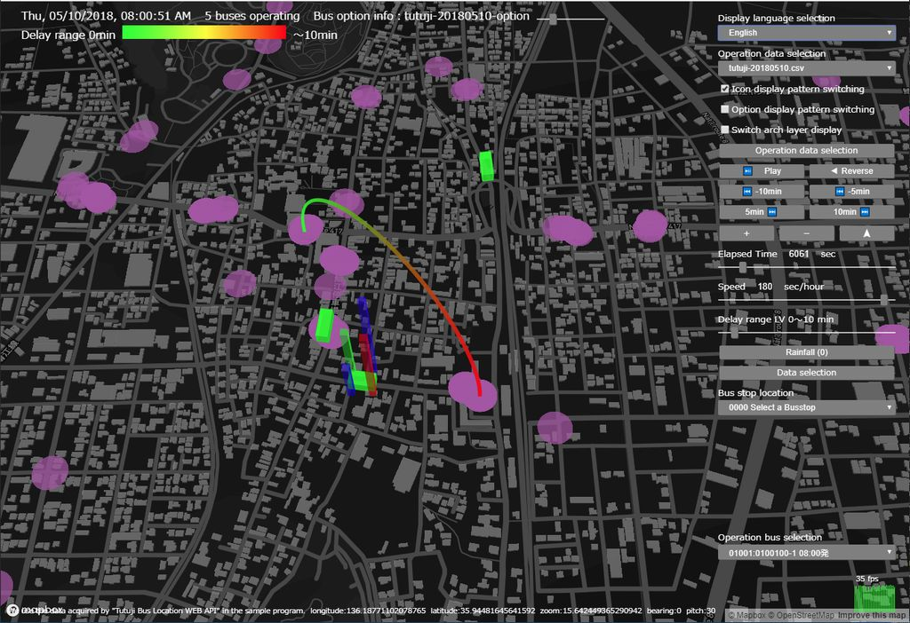

# Harmoware-VIS


## Introduction
This software is developed mainly by Kawaguchi lab, supported by JST OPERA (Program on Open Innovation Platform with Enterprises, Research Institute and Academia)
This library is for visualizing moving objects and the additional info of them using Deck.GL (http://uber.github.io/deck.gl/) developed by UBER

## Install

### Preparation
- Install node, npm
- Acquire Mapbox access token and Set the environment variable (MAPBOX_ACCESS_TOKEN)

### Run the software
```
git clone https://github.com/Harmoware/Harmoware-VIS
cd Harmoware-VIS
npm install
# example bus3d
npm run bus3d
```

## Using Harmoware-VIS

### Mapbox Accesstoken Setting

Acquire the Accesstoken from [mapbox.com](https://www.mapbox.com/ "mapbox.com")

### User Application Examples

```javascript
// sample using mapbox
import React from 'react';
import {
  Container, connectToHarmowareVis,
  HarmoVisLayers, MovesLayer, DepotsLayer,
  MovesInput, DepotsInput, SimulationDateTime,
  PauseButton, ForwardButton, ReverseButton, AddMinutesButton,
  ElapsedTimeRange, SpeedRange
} from 'harmoware-vis';

const MAPBOX_TOKEN = XXXXXXXXXX; //Access Token acquired from mapbox.com

class App extends Container {

  render() {
    const { viewport, actions, routePaths, lightSettings,
      animatePause, animateReverse, settime, secperhour, timeBegin, timeLength,
      movesbase, movedData, clickedObject, depotsData } = this.props;

    return (
      <div>
        <div className="controller_area">
          <ul>
            <li><MovesInput actions={actions} /></li>
            <li><DepotsInput actions={actions} /></li>
            <li>{animatePause ?
              <PlayButton actions={actions} /> :
              <PauseButton actions={actions} />}</li>
            <li>{animateReverse ?
              <ForwardButton actions={actions} /> :
              <ReverseButton actions={actions} />}</li>
            <li><AddMinutesButton addMinutes={-5} actions={actions} />&nbsp;
              <AddMinutesButton addMinutes={5} actions={actions} /></li>
            <li><SimulationDateTime timeBegin={timeBegin} settime={settime} /></li>
            <li><ElapsedTimeRange settime={settime} timeLength={timeLength} actions={actions} /></li>
            <li><SpeedRange secperhour={secperhour} actions={actions} /></li>
          </ul>
        </div>

        <div className="harmovis_area">
          <HarmoVisLayers
            viewport={viewport} actions={actions}
            mapboxApiAccessToken={MAPBOX_TOKEN}
            layers={[
              new MovesLayer({ routePaths, movesbase, movedData, clickedObject, actions, }),
              new DepotsLayer({ depotsData, }),
            ]}
          />
        </div>
      </div>
    );
  }
}
export default connectToHarmowareVis(App);
```

## Harmoware-VIS API

### Harmoware-VIS State

| props | Type | Default | Description |
| :------------ | :------------ | :------------ | :------------ |
| animatePause | Boolean | false | pause the animation |
| animateReverse | Boolean | false | play the animation backwards |
| bounds | object | {} | simulation area |
| defaultPitch | Number | 30 | default angle |
| defaultZoom | Number | 11.1 | expantion ratio |
| depotsBase | Array | [] | areas which poses depots data |
| depotsData | Array | [] | depots data |
| getDepotsOptionFunc | Function | null | a function to execute depots options |
| getMovesOptionFunc | Function | null | a function to execute moving objects options |
| leading | Number | 100 | wait time before executing the simulation |
| lightSettings | object | {...} | an object that contains light settings |
| movedData | Array | [] | data for the moving objects |
| movesbase | Array | [] | areas which poses moving objects data |
| clickedObject | Array | null | a selected object |
| routePaths | Array | [] | array of the operation routes |
| secperhour | Number | 3 | playback speed (sec/hour) |
| settime | Number | 0 | playback time |
| timeBegin | Number | 0 | simulation start UNIX time (sec) |
| timeLength | Number | 0 | simulation span (sec) |
| trailing | Number | 180 | trailing time after simulation end (sec) |
| viewport | object | {...} | Viewport of the map |
| loading | Boolean | false | Loading in progress |

### Harmoware-VIS Actions

| action | update props | Description |
| :------------ | :------------ | :------------ |
| addMinutes(Number) | settime  | add specified time (minutes) to the current `settime`|
| setTime(Number) | settime | set the specified time to the `settime` |
| setLeading(Number) | leading | set the specified time (sec) to the `leading` |
| setTrailing(Number) | trailing | set the specified time (sec) to the `trailing` |
| setViewport(object) | viewport | set the specified view data to the `viewport` |
| setLightSettings(object) | lightSettings | set the specified light source data to the `lightSettings` |
| setMovesBase(object/Array) | timeBegin, timeLength, bounds, movesbase | set the specified simulation base data to the `timeBegin` `timeLength`,`bounds`,`movesbase` |
| setDepotsBase(Array) | depotsBase | set the specified depots position data to the `depotsBase` |
| setAnimatePause(Boolean) | animatePause | set the specified animation playback control data to the `animatePause` |
| setAnimateReverse(Boolean) | animateReverse | set the specified animation forward and reverse control data to the `animateReverse` |
| setSecPerHour(Number) | secperhour | set the specified animation playback speed control data (sec/hour) to the `secperhour` |
| setClicked(Array) | clickedObject | set the specified clicked object data to the `clickedObject` |
| setRoutePaths(Array) | routePaths | set the specified route path data to the `routePaths` |
| setDefaultZoom(Number) | defaultZoom | set the specified default map zoom value to the `defaultZoom` |
| setDefaultPitch(Number) | defaultPitch | set the specified default map pitch value to the `defaultPitch` |
| setMovesOptionFunc(Function) | getMovesOptionFunc | set the specified moves data option info process function to the `getMovesOptionFunc` |
| setDepotsOptionFunc(Function) | getDepotsOptionFunc | set the specified depots data option info process function to the `getDepotsOptionFunc` |
| setLoading(Function) | loading | set the specified Loading in progress to the `loading` |

### Container

This is the class inherited from `React.Component`. This is the base component of the `Harmoware-VIS` library.
`settime` and animation frame update. Please output DOM with the `render` function.

##### Examples

```javascript
// using mapbox
import React from 'react';
import { Container, connectToHarmowareVis, HarmoVisLayers, ... } from 'harmoware-vis';
class App extends Container {
    render() {
        const { viewport, actions, ... } = this.props;
        return (
          <HarmoVisLayers
            viewport={viewport}  actions={actions} mapboxApiAccessToken={ ... } layers={[ ... ]}
          />
        );
    }
}
export default connectToHarmowareVis(App);
```
```javascript
// without using mapbox
import React from 'react';
import { Container, connectToHarmowareVis, HarmoVisNonMapLayers, ... } from 'harmoware-vis';
class App extends Container {
    render() {
        const { viewport, actions, ... } = this.props;
        return (
          <HarmoVisNonMapLayers
            viewport={viewport}  actions={actions} layers={[ ... ]}
          />
        );
    }
}
export default connectToHarmowareVis(App);
```

### connectToHarmowareVis

Utility to synchronize the state of `connectToHarmowareVis` to the prop of container component.
Since `state` and` actions` are directly bound below props, if you prefer other bind methods, you need to make Utility yourself.

### HarmoVisLayers

Display the layer that inherits the [Layer](https://github.com/uber/deck.gl/blob/master/docs/api-reference/layer.md "Layer") class of [deck.gl](https://github.com/uber/deck.gl "deck.gl") on the map obtained from mapbox.

##### Examples

```js
<HarmoVisLayers
    viewport={this.props.viewport} actions={this.props.actions}
    mapboxApiAccessToken={MAPBOX_TOKEN}
    layers={ [ ... ] }
/>
```

##### HarmoVisLayers Properties

| Properties | PropTypes | Default | Description |
| :------------ | :------------ | :------------ | :------------ |
| actions | object required | -- | Harmoware-VIS state `actions` |
| viewport | object required | -- | Harmoware-VIS state `viewport` |
| mapboxApiAccessToken | string required | -- | The access token of mapbox.com |
| mapStyle | string option | 'mapbox://styles/mapbox/dark-v8' | A map style URL of mapbox.com. |
| layers | array required | -- | Array of Layer (※) |
| onChangeViewport | func option | this.props.actions.setViewport | Harmoware-VIS Actions `setViewport` |

※1 An instance of a class that inherits the [Layer](https://github.com/uber/deck.gl/blob/master/docs/api-reference/layer.md "Layer") class of [deck.gl](https://github.com/uber/deck.gl "deck.gl").

### HarmoVisNonMapLayers

3D display the layer that inherits the [Layer](https://github.com/uber/deck.gl/blob/master/docs/api-reference/layer.md "Layer") class of [deck.gl](https://github.com/uber/deck.gl "deck.gl").

##### Examples

```js
<HarmoVisNonMapLayers
    viewport={this.props.viewport} actions={this.props.actions}
    layers={ [ ... ] }
/>
```

##### HarmoVisNonMapLayers Properties

| Properties | PropTypes | Default | Description |
| :------------ | :------------ | :------------ | :------------ |
| actions | object required | -- | Harmoware-VIS state `actions` |
| viewport | object required | -- | Harmoware-VIS state `viewport` |
| layers | array required | -- | Array of Layer (※) |
| onChangeViewport | func option | this.props.actions.setViewport | Harmoware-VIS Actions `setViewport` |

※1 An instance of a class that inherits the [Layer](https://github.com/uber/deck.gl/blob/master/docs/api-reference/layer.md "Layer") class of [deck.gl](https://github.com/uber/deck.gl "deck.gl").

## Harmoware-VIS Layers

Harmoware-VIS Layer List

### MovesLayer

Simulate a mobile object such as a vehicle on a map acquired from mapbox.com.

##### Examples

```js
<HarmoVisLayers ...
  layers={[
      new MovesLayer({ routePaths: this.props.routePaths,
        movesbase: this.props.movesbase,
        movedData: this.props.movedData,
        clickedObject: this.props.clickedObject,
        actions: this.props.actions 
      })
  ]}
/>
```

##### MovesLayer Properties

| Properties | PropTypes | Default | Description |
| :------------ | :------------ | :------------ | :------------ |
| actions | object required | -- | Harmoware-VIS state `actions` |
| routePaths | Array required | -- | Harmoware-VIS state `routePaths` |
| movesbase| Array required | -- | Harmoware-VIS state `movesbase` |
| movedData| Array required | -- | Harmoware-VIS state `movedData` |
| clickedObject | Array required |--  | Harmoware-VIS state `clickedObject` |
| layerRadiusScale | Number option | 1 | Icon size scale |
| layerOpacity | Number option | 0.75 | Icon opacity |
| getColor | Function option | x => x.color ││ GREEN | Icon color specification accessor |
| optionVisible | Boolean option | true | Option information display availability |
| optionChange | Boolean option | false | option Display pattern switching |
| lightSettings | object option | -- | Required if optionVisible is set to true. Harmoware-VIS state `lightSettings` |
| optionOpacity | Number option | 0.25 | option Information opacity |
| optionCellSize | Number option | 10 | option information cell size |
| optionElevationScale | Number option | 1 | option information elevation scale |
| getColor1～4 | Function option | x => (x.optColor && x.optColor[0～3]) ││ x.color ││ GREEN | option information color specification accessor |
| getElevation1～4 | Function option | x => (x.optElevation && x.optElevation[0～3]) ││ 0 | option information elevation specification accessor |
| getCubeColor | Function option | x => x.optColor ││ [x.color] ││ [GREEN] | option information (cube type) color specification accessor |
| getCubeElevation | Function option | x => x.optElevation ││ [0] | option information (cube type) elevation specification accessor |

##### The json format of the simulation data file

- format 1
```js
// bounds timeBegin timeLength movesbase
{   "timeBegin": 9999999999, // simulation start UNIX time (sec)
    "timeLength": 99999, // simulation span (sec)
    "bounds": { // simulation area (north, south, west, east)
        "northlatitude": 99.99999, "southlatitude": 99.99999,
        "westlongitiude" 999.99999, "eastlongitiude": 999.99999,
    },
    "movesbase": [ // Simulation data format *(required)
        { // Define time and route for each operation unit (one operation)
          // (`departuretime`, `arrivaltime`, `elapsedtime` is the elapsed time (sec) from timeBegin)
          // (When `timeBegin` is omitted, `departuretime`, `arrivaltime`, `elapsedtime` is UNIX time (second))
            "departuretime": 99999, // departuretime (sec) *(required)
            "arrivaltime": 99999, // arrivaltime (sec) *(required)
            "operation": [ // Define time and route for each operation unit (one operation) *(required)
                { // Defined by elapsed time
                    "elapsedtime": 99999, // elapsedtime (sec) *(required)
                    // Specified in `position` or `longitude-latitude` format
                    "position": [999.9999, 999.9999, 999.9999], // Position of `elapsedtime` (x,y,z) *(required)
                    "longitude": 999.9999, // Position of `elapsedtime` (longitude) *(required)
                    "latitude": 99.999, // Position of `elapsedtime` (latitude) *(required)
                },・・・・・・
            ],
        },・・・・・・
    ],
}
```

- format 2
```js
[ // Simulation data format
    { // Define time and route for each operation unit (one operation)
      // (`departuretime`, `arrivaltime`, `elapsedtime` is UNIX time (second))
        "departuretime": 9999999999, // departuretime (sec) *(required)
        "arrivaltime": 9999999999, // arrivaltime (sec) *(required)
        "operation": [ // Define time and route for each operation unit (one operation) *(required)
            { // Defined by elapsed time
                "elapsedtime": 9999999999, // elapsedtime (sec) *(required)
                // Specified in `position` or `longitude-latitude` format
                "position": [999.9999, 999.9999, 999.9999], // Position of `elapsedtime` (x,y,z) *(required)
                "longitude": 999.9999, // Position of `elapsedtime` (longitude) *(required)
                "latitude": 99.999, // Position of `elapsedtime` (latitude) *(required)
            },・・・・・・
        ],
    },・・・・・・
]
```

### DepotsLayer

Simulate depots or stations on a map acquired from mapbox.com.

##### Examples

```js
<HarmoVisLayers ...
    layers={[
        new DepotsLayer( { depotsData: this.props.depotsData } )
    ]}
/>
```

##### DepotsLayer Properties

| Properties | PropTypes | Default | Description |
| :------------ | :------------ | :------------ | :------------ |
| depotsData| Array required | -- | Harmoware-VIS state `depotsData` |
| layerRadiusScale | Number option | 1 | Icon size scale |
| layerOpacity | Number option | 0.5 | Icon opacity |
| getColor | Function option | x => x.color ││ DARKMAGENTA | Icon color specification accessor |
| optionVisible | Boolean option | true | Option information display availability |
| optionChange | Boolean option | false | option Display pattern switching |
| lightSettings | object option | -- | Required if optionVisible is set to true. Harmoware-VIS state `lightSettings` |
| optionOpacity | Number option | 0.25 | option Information opacity |
| optionCellSize | Number option | 15 | option information cell size |
| optionElevationScale | Number option | 1 | option information elevation scale |
| getColor1～4 | Function option | x => (x.optColor && x.optColor[0～3]) ││ x.color ││ DARKMAGENTA | option information color specification accessor |
| getElevation1～4 | Function option | x => (x.optElevation && x.optElevation[0～3]) ││ 0 | option information elevation specification accessor |

##### The json format of the depots data file

```js
// Specified in `position` or `longitude-latitude` format
[   {   "position": [999.9999, 999.9999, 999.9999], // depots position (x,y,z)
    },・・・・・・
]
[   {   "longitude": 999.9999, // depots position (longitude)
        "latitude": 99.9999, // depots position (latitude)
    },・・・・・・
]
```

### MovesNonmapLayer

3D simulation of mobile objects.

##### Examples

```js
<HarmoVisNonMapLayers ...
    layers={[
        new MovesNonmapLayer( { routePaths: this.props.routePaths,
                        movesbase: this.props.movesbase,
                        movedData: this.props.movedData,
                        clickedObject: this.props.clickedObject,
                        actions: this.props.actions } )
    ]}
/>
```

##### MovesNonmapLayer Properties

| Properties | PropTypes | Default | Description |
| :------------ | :------------ | :------------ | :------------ |
| movedData| Array required | -- | Harmoware-VIS state `movedData` |
| movesbase| Array required | -- | Harmoware-VIS state `movesbase` |
| actions | object required | -- | Harmoware-VIS state `actions` |
| routePaths | Array required | -- | Harmoware-VIS state `routePaths` |
| clickedObject | Array required |--  | Harmoware-VIS state `clickedObject` |
| layerOpacity | Number option | 0.75 | Icon opacity |
| getColor | Function option | x => x.color ││ GREEN | Icon color specification accessor |
| getRadius | Function option | x => x.radius ││ 2 | Icon radius specification accessor |


##### The json format of the simulation data file

###### Format1
```js
// bounds timeBegin timeLength movesbase
{   "timeBegin": 9999999999, // simulation start UNIX time (sec)
    "timeLength": 99999, // simulation span (sec)
    "movesbase": [ // Simulation data format *(required)
        { // Define time and route for each operation unit (one operation)
          // (`departuretime`, `arrivaltime`, `elapsedtime` is the elapsed time (sec) from timeBegin)
          // (When `timeBegin` is omitted, `departuretime`, `arrivaltime`, `elapsedtime` is UNIX time (second))
            "departuretime": 99999, // departuretime (sec) *(required)
            "arrivaltime": 99999, // arrivaltime (sec) *(required)
            "operation": [ // Define time and route for each operation unit (one operation) *(required)
                { // Defined by elapsed time
                    "elapsedtime": 99999, // elapsedtime (sec) *(required)
                    "position": [999.9999, 999.9999, 999.9999], // Position of `elapsedtime` (x,y,z) *(required)
                },・・・・・・
            ],
        },・・・・・・
    ],
}
```

###### Format2
```js
[ // Simulation data format
    { // Define time and route for each operation unit (one operation)
      // (`departuretime`, `arrivaltime`, `elapsedtime` is UNIX time (second))
        "departuretime": 9999999999, // departuretime (sec) *(required)
        "arrivaltime": 9999999999, // arrivaltime (sec) *(required)
        "operation": [ // Define time and route for each operation unit (one operation) *(required)
            { // Defined by elapsed time
                "elapsedtime": 9999999999, // elapsedtime (sec) *(required)
                "position": [999.9999, 999.9999, 999.9999], // Position of `elapsedtime` (x,y,z) *(required)
            },・・・・・・
        ],
    },・・・・・・
]
```

### FixedPointLayer

3D simulation of fixed objects.

##### Examples

```js
<HarmoVisNonMapLayers ...
    layers={[
        new FixedPointLayer( { depotsData: this.props.depotsData } )
    ]}
/>
```

##### FixedPointLayer Properties

| Properties | PropTypes | Default | Description |
| :------------ | :------------ | :------------ | :------------ |
| depotsData| Array required | -- | Harmoware-VIS state `depotsData` |
| layerOpacity | Number option | 0.75 | Icon opacity |
| getColor | Function option | x => x.color ││ DARKMAGENTA | Icon color specification accessor |
| getRadius | Function option | x => x.radius ││ 2 | Icon radius specification accessor |

##### The json format of the fixed data file

```js
// depotsData
[   {   "position": [999.9999, 999.9999, 999.9999], // display position (x,y,z) *(required)
    },・・・・・・
]
```

### LineMapLayer

3D simulation of line objects.

##### Examples

```js
<HarmoVisNonMapLayers ...
    layers={[
        new LineMapLayer( { linemapData: this.props.linemapData } )
    ]}
/>
```

##### LineMapLayer Properties

| Properties | PropTypes | Default | Description |
| :------------ | :------------ | :------------ | :------------ |
| linemapData| Array required | -- | Harmoware-VIS state `linemapData` |
| layerOpacity | Number option | 1.0 | Line opacity |
| strokeWidth | Number option | 20 | Line Width |
| getColor | Function option | x => x.color ││ WHITE | Line color specification accessor |

##### The json format of the line data file

```js
// linemapData
[   { "sourcePosition": [999.9999, 999.9999, 999.9999], // line start position (x,y,z) *(required)
      "targetPosition": [999.9999, 999.9999, 999.9999], // line end position (x,y,z) *(required)
    },・・・・・・
]
```

## Harmoware-VIS Control component

Harmoware-VIS component list

### MovesInput

Display a dialog to select the file for which "moves base data" is set, and set it to Harmoware-VIS state `bounds`, `timeBegin`, `timeLength`, `movebase` from the read data.

##### Examples

```js
<MovesInput actions={this.props.actions} />
```

##### MovesInput Properties

| Properties | PropTypes | Default | Description |
| :------------ | :------------ | :------------ | :------------ |
| actions | object required | -- | Harmoware-VIS state `actions` |
| i18n | Object option | -- | formatError caption `i18n.formatError` |

### DepotsInput

Display a dialog to select the file for which "depots base data" is set, and set it to Harmoware-VIS state `depotsBase` from the read data.

##### Examples

```js
<DepotsInput actions={this.props.actions} />
```

##### DepotsInput Properties

| Properties | PropTypes | Default | Description |
| :------------ | :------------ | :------------ | :------------ |
| actions | object required | -- | Harmoware-VIS state `actions` |
| i18n | Object option | -- | formatError caption `i18n.formatError` |

### LinemapInput

Display a dialog to select the file for which "line map data" is set, and set it to Harmoware-VIS state `linemapData` from the read data.

##### Examples

```js
<LinemapInput actions={this.props.actions} />
```

##### LinemapInput Properties

| Properties | PropTypes | Default | Description |
| :------------ | :------------ | :------------ | :------------ |
| actions | object required | -- | Harmoware-VIS state `actions` |
| i18n | Object option | -- | formatError caption `i18n.formatError` |

### LoadingIcon

An icon representing loading is displayed in the center of the screen.

##### Examples

```js
<LoadingIcon loading={this.props.loading} />
```

##### LoadingIcon Properties

| Properties | PropTypes | Default | Description |
| :------------ | :------------ | :------------ | :------------ |
| loading | boolean required | false | Harmoware-VIS state `loading` |
| color | string option | 'white' | loading icon color |

### AddMinutesButton

A button object that sets the value obtained by adding addMinutes minutes from "simulation time (`settime`)" to Harmoware-VIS state `settime`.

##### Examples

```js
<AddMinutesButton addMinutes={5} actions={this.props.actions} />
```

##### AddMinutesButton Properties

| Properties | PropTypes | Default | Description |
| :------------ | :------------ | :------------ | :------------ |
| actions | object required | -- | Harmoware-VIS state `actions` |
| children | node required | -- | Button Caption |
| addMinutes | number option | 10 | Time to add (min) |
| i18n | Object option | 'min' | minutes caption `i18n.minutesCaption` |

### ElapsedTimeRange

A range object that sets the specified "simulation time (`settime`)" to Harmoware-VIS state `settime`.

##### Examples

```js
<ElapsedTimeRange settime={this.props.settime} timeLength={this.props.timeLength} actions={this.props.actions} />
```

##### ElapsedTimeRange Properties

| Properties | PropTypes | Default | Description |
| :------------ | :------------ | :------------ | :------------ |
| settime | number required | -- | Harmoware-VIS state `settime` |
| timeLength | number required | -- | Harmoware-VIS state `timeLength` |
| actions | object required | -- | Harmoware-VIS state `actions` |
| min | number option | -100 | Range(`settime` sec) minimum |
| step | number option | 1 | Range include |

### PauseButton

Harmoware-VIS state A button object that updates `animatePause` to true.

##### Examples

```js
<PauseButton actions={this.props.actions} />
```

##### PauseButton Properties

| Properties | PropTypes | Default | Description |
| :------------ | :------------ | :------------ | :------------ |
| actions | object required | -- | Harmoware-VIS state `actions` |
| children | string option | -- | Button Caption |
| i18n | Object option | 'PAUSE' | pauseButton caption `i18n.pauseButtonCaption` |

### PlayButton

Harmoware-VIS state A button object that updates `animatePause` to false.

##### Examples

```js
<PlayButton actions={this.props.actions} />
```

##### PlayButton Properties

| Properties | PropTypes | Default | Description |
| :------------ | :------------ | :------------ | :------------ |
| actions | object required | -- | Harmoware-VIS state `actions` |
| children | string option | -- | Button Caption |
| i18n | Object option | 'PLAY' | playButton caption `i18n.playButtonCaption` |

### ForwardButton

Harmoware-VIS state A button object that updates `animateReverse` to false.

##### Examples

```js
<ForwardButton actions={this.props.actions} />
```

##### ForwardButton Properties

| Properties | PropTypes | Default | Description |
| :------------ | :------------ | :------------ | :------------ |
| actions | object required | -- | Harmoware-VIS state `actions` |
| children | node option | -- | Button Caption |
| i18n | Object option | 'FORWARD' | forwardButton caption `i18n.forwardButtonCaption` |

### ReverseButton

Harmoware-VIS state A button object that updates `animateReverse` to true.

##### Examples

```js
<ReverseButton actions={this.props.actions} />
```

##### ReverseButton Properties

| Properties | PropTypes | Default | Description |
| :------------ | :------------ | :------------ | :------------ |
| actions | object required | -- | Harmoware-VIS state `actions` |
| children | node option | -- | Button Caption |
| i18n | Object option | -- | formatError caption `i18n.formatError` |

### SimulationDateTime

Component that edits simulation time.

##### Examples

```js
<SimulationDateTime timeBegin={this.props.timeBegin} settime={this.props.settime} />
```

##### SimulationDateTime Properties

| Properties | PropTypes | Default | Description |
| :------------ | :------------ | :------------ | :------------ |
| timeBegin | number required | -- | Harmoware-VIS state `timeBegin` |
| settime | number required | -- | Harmoware-VIS state `settime` |
| locales | string option | 'ja-JP' | Argument of `dateObj.toLocaleString` |
| options | object option | { year:'numeric',month:'2-digit',day:'2-digit',   hour:'2-digit',minute:'2-digit',second:'2-digit',    weekday:'short' } | Argument of `dateObj.toLocaleString` |

### SpeedRange

A range object that sets the specified "Playback speed (sec/hour) (`secperhour`)" to Harmoware-VIS state `secperhour`.

##### Examples

```js
<SpeedRange secperhour={this.props.secperhour} actions={this.props.actions} />
```

##### SpeedRange Properties

| Properties | PropTypes | Default | Description |
| :------------ | :------------ | :------------ | :------------ |
| secperhour | number required | -- | Harmoware-VIS state `secperhour` |
| actions | object required | -- | Harmoware-VIS state `actions` |
| maxsecperhour | number option | 3600 | Range maximum (Playback speed (sec/hour))  |
| min | number option | 1 | Range minimum |
| step | number option | 1 | Range include |
